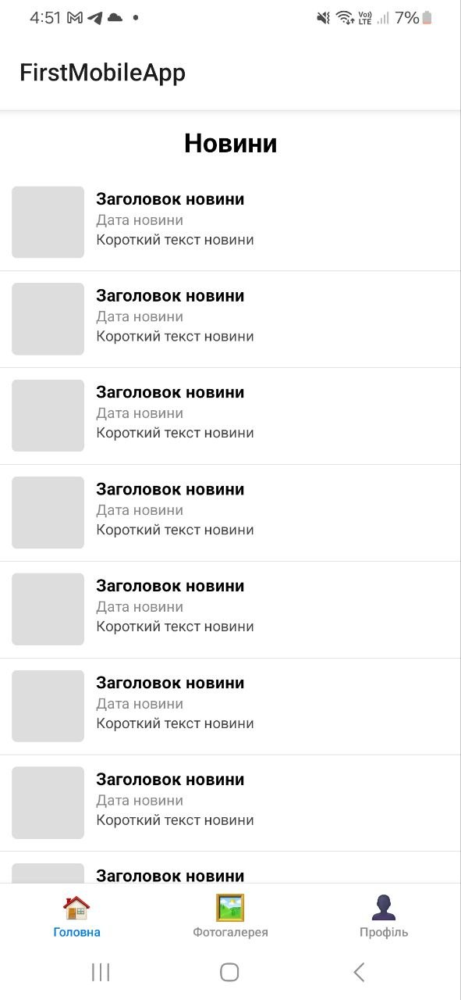
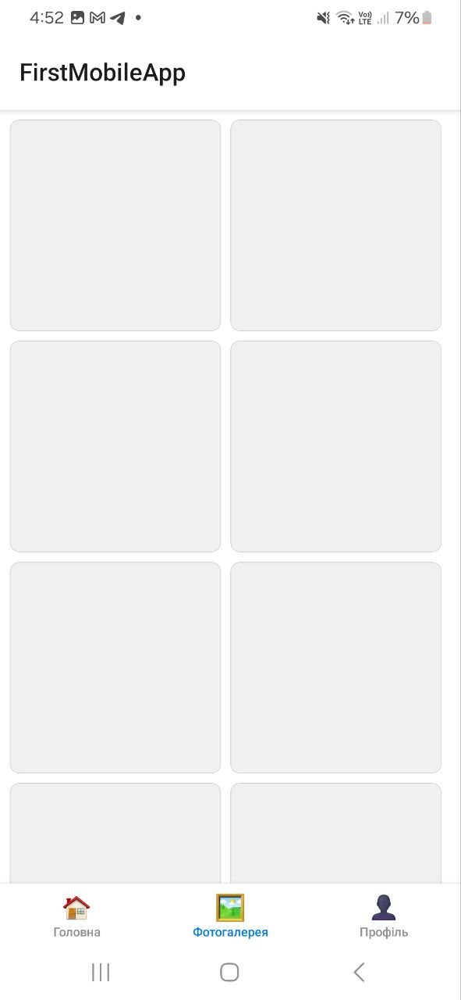
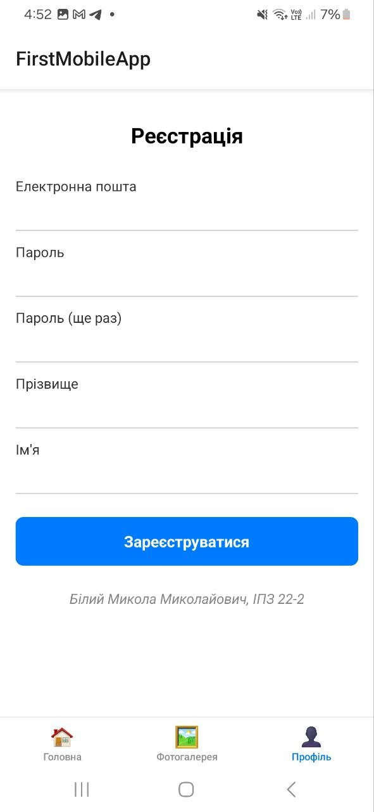
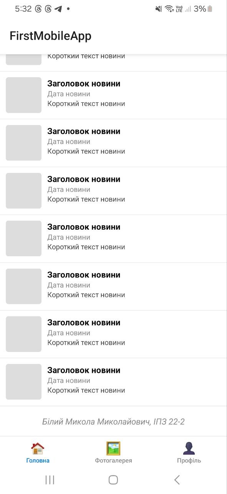
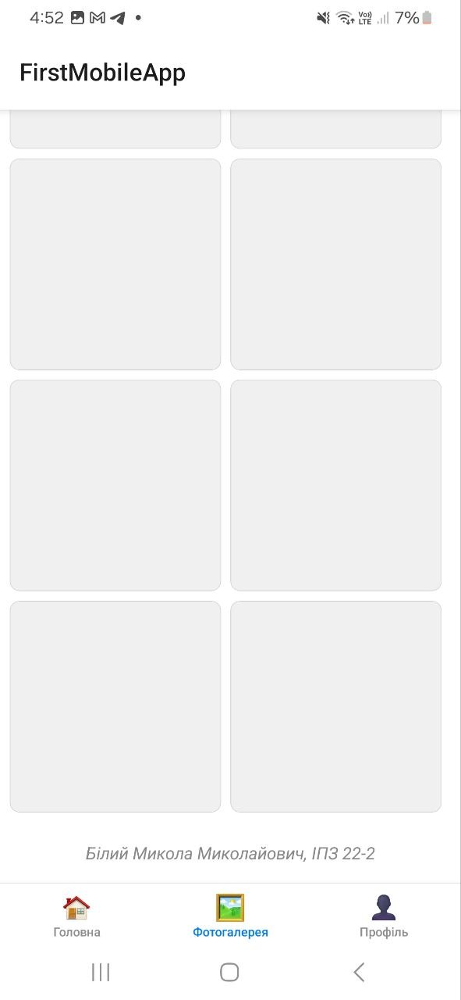

# Лабораторна робота №1
## React Native + Expo — Перший мобільний додаток

**Студент:** Білий Микола Миколайович  
**Група:** ІПЗ 22-2

---

## Опис проєкту

Мобільний застосунок **FirstMobileApp** розроблений за допомогою React Native та Expo.  
Додаток містить три екрани з навігацією через Bottom Tab Navigator:

- **Головна** — список новин з заголовком, датою та коротким описом
- **Фотогалерея** — сітка із фото-плейсхолдерами у двох колонках
- **Профіль** — форма реєстрації з полями email, пароль, прізвище та ім'я

---

## Інструкція із запуску

### Вимоги
- Node.js (версія 18+)
- npm або yarn
- Expo Go на мобільному пристрої

### Встановлення та запуск

1. Клонувати репозиторій:
```bash
   git clone https://github.com/YOUR_USERNAME/MobileLabsRN2026.git
   cd MobileLabsRN2026/lab1
```

2. Встановити залежності:
```bash
   npm install
```

3. Запустити проєкт:
```bash
   npx expo start
```

4. Відсканувати QR-код додатком **Expo Go** на телефоні

---

## Скріншоти

| Головна | Фотогалерея | Профіль |
|---------|-------------|---------|
|  |  |  |
|  |  | |
---

## Способи запуску мобільного додатка

### 1. Expo Go (реальний пристрій) — використано в роботі
Найпростіший спосіб для тестування на реальному пристрої.  
Телефон і комп'ютер мають бути в одній Wi-Fi мережі.  
Запуск: `npx expo start` → сканування QR-коду через Expo Go.

**Особливості:** швидкий старт, не потребує збірки, але обмежений можливостями Expo SDK.

### 2. Tunnel (`--tunnel`)
Дозволяє підключитись до сервера через інтернет без спільної мережі.  
Запуск: `npx expo start --tunnel`

**Особливості:** працює без спільного Wi-Fi, але повільніше через ngrok-тунель.

### 3. Android Emulator
Запуск додатку у віртуальному Android-пристрої через Android Studio.  
Потребує встановлення Android Studio та AVD Manager.

**Особливості:** не потрібен реальний пристрій, але вимагає багато ресурсів комп'ютера.

### 4. iOS Simulator
Доступний лише на macOS через Xcode.  
Запуск: `npx expo start` → натиснути `i` у терміналі.

**Особливості:** точна симуляція iOS, але тільки для Mac з Xcode.