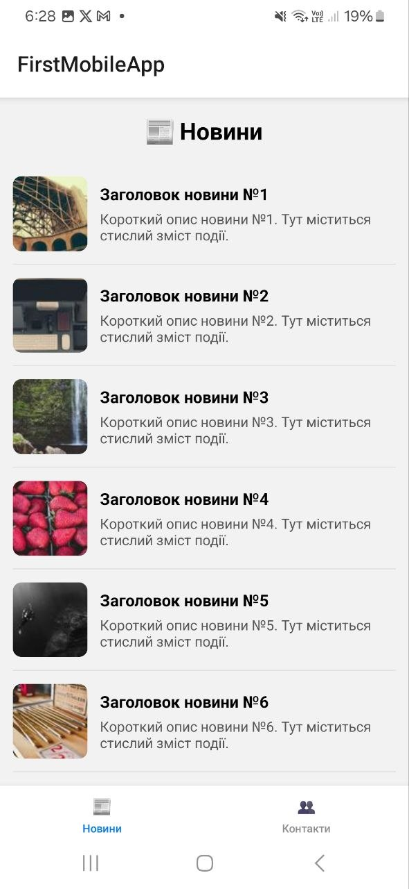

# Лабораторна робота №2
## Вкладена навігація та оптимізація списків у React Native

**Студент:** Білий Микола Миколайович  
**Група:** ІПЗ 22-2

---

## Опис проєкту

Мобільний застосунок з вкладеною навігацією та оптимізованим відображенням списків.

Реалізовано:
- **Stack Navigator** — перехід між списком новин та екраном деталей
- **Bottom Tab Navigator** — навігація між Новинами та Контактами
- **FlatList** — список новин з Pull-to-Refresh та Infinite Scroll
- **SectionList** — згрупований список контактів
- Кастомне меню з аватаром, ПІБ та групою

---

## Інструкція із запуску

1. Клонувати репозиторій:
```bash
   git clone https://github.com/YOUR_USERNAME/MobileLabsRN2026.git
   cd MobileLabsRN2026/lab2
```

2. Встановити залежності:
```bash
   npm install
```

3. Запустити проєкт:
```bash
   npx expo start
```

4. Відсканувати QR-код додатком **Expo Go** на телефоні

---

## Скріншоти

| Новини | Деталі | Контакти |
|--------|--------|----------|
|  |  |  |

---

## Висновки (відповіді на контрольні запитання)

### 1. Чим відрізняється FlatList від ScrollView?

`ScrollView` рендерить всі елементи одразу при завантаженні, що призводить до великого споживання пам'яті при великих списках. `FlatList` використовує віртуалізацію — рендерить лише видимі елементи, видаляючи невидимі з дерева компонентів. Це значно підвищує продуктивність при роботі з великими наборами даних.

### 2. Що таке віртуалізація списків?

Віртуалізація — це техніка оптимізації, при якій в пам'яті зберігаються та відображаються лише ті елементи списку, які видно користувачу на екрані. Коли користувач прокручує список, невидимі елементи видаляються з DOM-подібного дерева, а нові — додаються. Це дозволяє працювати з тисячами елементів без втрати продуктивності.

### 3. Як здійснюється передача параметрів між екранами?

Параметри передаються через другий аргумент функції `navigation.navigate()`:
```javascript
navigation.navigate('Details', { item: selectedItem });
```
На екрані-отримувачі параметри доступні через `route.params`:
```javascript
const { item } = route.params;
```

### 4. Що таке вкладена навігація?

Вкладена навігація — це архітектурний патерн, коли один навігатор містить інший. Наприклад, у цій роботі Tab Navigator містить Stack Navigator для екрану новин. Це дозволяє створювати складні навігаційні структури: переходити між вкладками і водночас мати стек екранів всередині кожної вкладки.

### 5. У яких випадках застосовується SectionList?

`SectionList` використовується коли дані потрібно відобразити групами з заголовками секцій. Наприклад: список контактів згрупований за алфавітом, список товарів за категоріями, список новин за датою. У цій роботі `SectionList` використано для відображення контактів, згрупованих за категоріями: Викладачі, Студенти, Адміністрація.