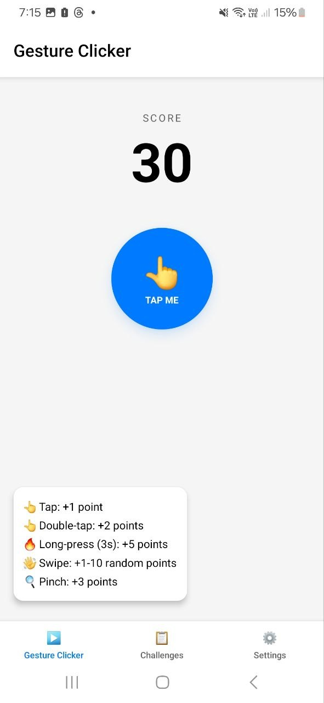
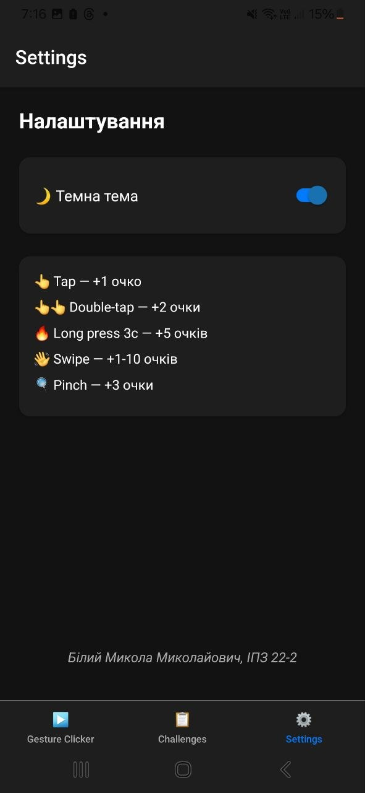
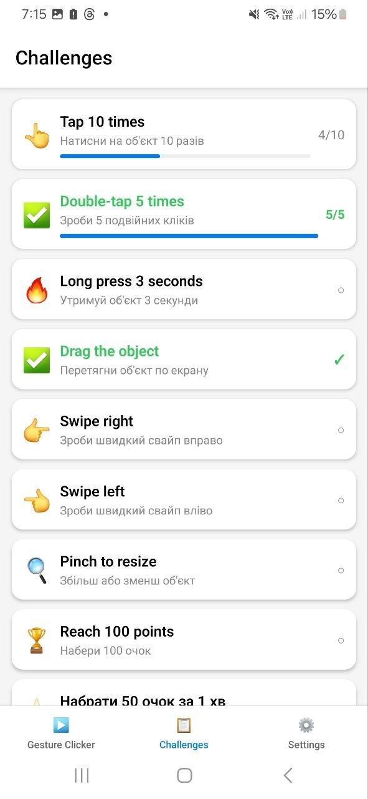
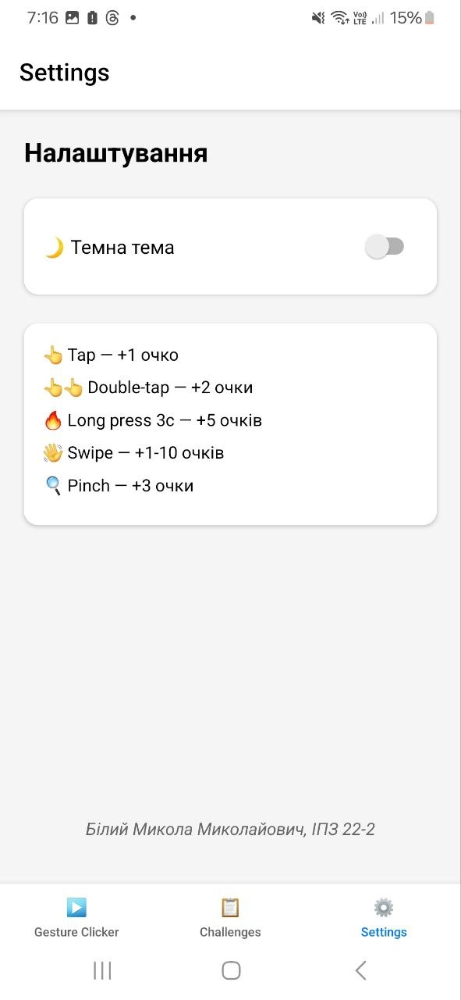

# Лабораторна робота №3
## Використання кастомних жестів у React Native та стилізація інтерфейсу мобільного застосунку
 
**Студент:** Білий Микола Миколайович  
**Група:** ІПЗ 22-2
 
---
 
## Опис проєкту
 
Мобільний застосунок — гра-клікер з використанням жестових взаємодій користувача та стилізацією інтерфейсу з підтримкою світлої і темної теми.
 
Реалізовано:
- **TapGestureHandler** — коротке натискання (+1 очко)
- **TapGestureHandler (double)** — подвійний клік (+2 очки)
- **LongPressGestureHandler** — утримання 3 секунди (+5 очків)
- **PanGestureHandler** — перетягування об'єкта по екрану
- **FlingGestureHandler** — свайп вправо/вліво (+1-10 випадкових очків)
- **PinchGestureHandler** — масштабування об'єкта (+3 очки)
- **Bottom Tab Navigator** — навігація між екранами
- **Темна/світла тема** — перемикання через сторінку налаштувань
- **Сторінка завдань** — 9 завдань з прогресом та статусами виконання
---
 
## Інструкція із запуску
 
1. Клонувати репозиторій:
```bash
git clone https://github.com/YOUR_USERNAME/MobileLabsRN2026.git
cd MobileLabsRN2026/lab3
```
 
2. Встановити залежності:
```bash
npm install
```
 
3. Запустити проєкт:
```bash
npx expo start
```
 
4. Відсканувати QR-код додатком **Expo Go** на телефоні
---
 
## Скріншоти
 
| Головний екран (світла тема) | Головний екран (темна тема) | Завдання | Налаштування |
|---|---|---|---|
|  |  |  |  |
 
---
 
## Реалізований функціонал
 
### 1. Головний екран (GameScreen)
- Лічильник очок у верхній частині екрана
- Об'єкт `TAP ME` реагує на всі 6 типів жестів
- Анімовані поплавці (`+1`, `+2 🎯` тощо) при кожній взаємодії
- Легенда з поясненням жестів у нижньому лівому куті
- Об'єкт можна перетягувати по всьому екрану (PanGesture)
- Масштабування об'єкта через Pinch-жест
### 2. Сторінка завдань (ChallengesScreen)
- 9 завдань із відстеженням прогресу в реальному часі:
  - Натиснути 10 разів (прогрес-бар)
  - Подвійний клік 5 разів (прогрес-бар)
  - Утримати 3 секунди
  - Перетягнути об'єкт
  - Свайп вправо
  - Свайп вліво
  - Масштабування (Pinch)
  - Набрати 100 очок
  - ⭐ Власне завдання: набрати 50 очок за 1 хвилину
- Виконані завдання позначаються ✅ та зеленим кольором
### 3. Сторінка налаштувань (SettingsScreen)
- Перемикач темної/світлої теми
- Довідка по жестах та їх значенням
- Підпис автора
### 4. Навігація
- `@react-navigation/bottom-tabs` — нижня вкладкова навігація між трьома екранами
### 5. Стилізація
- `StyleSheet` з динамічною темою через `theme`-об'єкт
- Підтримка **світлої** та **темної** теми
- Картки з `elevation`, `borderRadius`, тіні для кнопок
---
 
## Висновки (відповіді на контрольні запитання)
 
### 1. Що таке GestureHandler і навіщо він потрібен?
 
`react-native-gesture-handler` — бібліотека для обробки жестів, яка працює на рівні нативного потоку (UI thread), а не JS-потоку. Це забезпечує плавнішу і точнішу реакцію на взаємодії, ніж стандартний `TouchableOpacity` чи `PanResponder` з React Native.
 
### 2. Як працює композиція жестів (Gesture.Simultaneous / Exclusive)?
 
`Gesture.Simultaneous()` дозволяє кільком жестам спрацьовувати одночасно (наприклад, Pan + Pinch). `Gesture.Exclusive()` дозволяє спрацювати лише одному з кількох жестів — пріоритет отримує той, що вказаний першим. У цій роботі `Exclusive(doubleTap, tap)` гарантує, що подвійний клік не рахується як два одиночних.
 
### 3. Яка різниця між Fling та Pan?
 
`PanGestureHandler` відстежує безперервний рух пальця і надає координати в реальному часі — використовується для перетягування. `FlingGestureHandler` реагує лише на швидкий кидок у певному напрямку — він не відстежує позицію, а лише факт швидкого свайпу.
 
### 4. Як реалізувати підтримку темної теми?
 
У цій роботі тема реалізована як JS-об'єкт із набором кольорів (`bg`, `card`, `text`, `sub`), який передається через пропси в кожен екран. Перемикач у налаштуваннях змінює стан `darkMode` у кореневому компоненті, що викликає ре-рендер з новими кольорами. Альтернативний підхід — використання `useColorScheme()` або Context API.
 
### 5. Навіщо потрібен GestureHandlerRootView?
 
`GestureHandlerRootView` — це обов'язковий кореневий компонент для `react-native-gesture-handler`. Без нього жести не будуть правильно оброблятися на Android. Його необхідно розмістити на найвищому рівні дерева компонентів, зазвичай в `App.js`.
 
---
 
## Використані технології
 
| Технологія | Версія | Призначення |
|---|---|---|
| React Native | 0.81.5 | Основний фреймворк |
| Expo | ~54.0.33 | Середовище розробки |
| react-native-gesture-handler | ~2.28.0 | Обробка жестів |
| @react-navigation/bottom-tabs | ^7.15.11 | Навігація |
 
---
 
## Джерела
 
- https://docs.swmansion.com/react-native-gesturehandler/docs/fundamentals/installation
- https://docs.swmansion.com/react-native-gesturehandler/docs/category/gestures
- https://reactnavigation.org/docs/getting-started