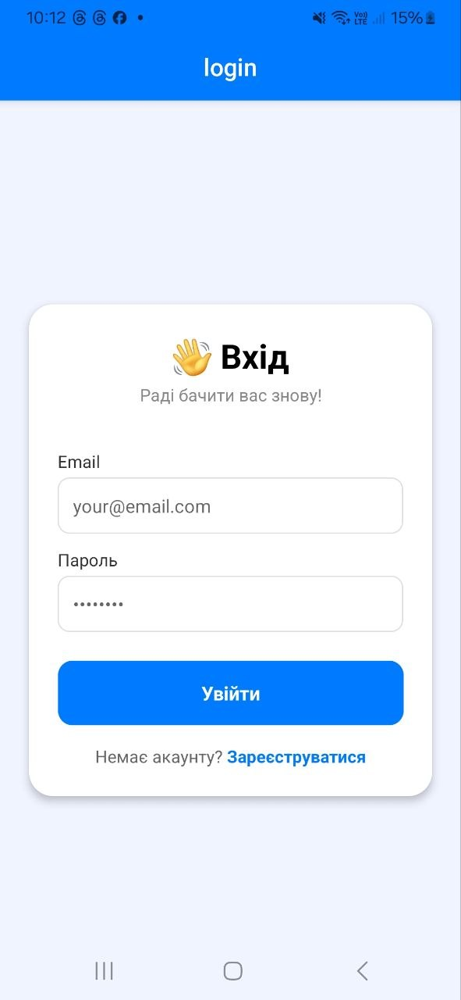
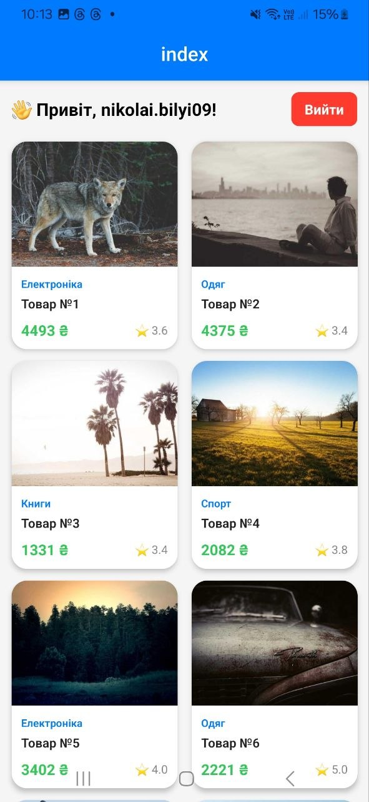

# Лабораторна робота №5
## Побудова навігації з використанням Expo Router

**Студент:** Білий Микола Олексійович  
**Група:** ІПЗ 22-2

---

## Опис проєкту

Мобільний застосунок з file-based маршрутизацією через Expo Router.

Реалізовано:
- **AuthContext** — глобальний контекст авторизації
- **Захищені маршрути** `(app)` — редірект на login якщо не авторизований
- **Публічні маршрути** `(auth)` — екрани входу та реєстрації
- **Каталог товарів** — FlatList з картками товарів
- **Динамічні маршрути** — деталі товару `/details/[id]`
- **Сторінка 404** — обробка неіснуючих маршрутів

---

## Інструкція із запуску

1. Клонувати репозиторій:
```bash
   git clone https://github.com/YOUR_USERNAME/MobileLabsRN2026.git
   cd MobileLabsRN2026/lab5
```

2. Встановити залежності:
```bash
   npm install
```

3. Запустити проєкт:
```bash
   npx expo start
```

4. Відсканувати QR-код додатком **Expo Go** на телефоні

---

## Скріншоти

| Вхід | Реєстрація | Каталог | Деталі |
|------|------------|---------|--------|
|  |  |  |  |

---

## Висновки (відповіді на контрольні запитання)

### 1. Як реалізується перенаправлення неавторизованого користувача?

В Expo Router перенаправлення реалізується у файлі `_layout.jsx` захищеної групи маршрутів. Якщо `isAuthenticated === false`, повертається компонент `<Redirect href="/login" />`, який автоматично перенаправляє користувача на екран входу без відображення захищеного контенту.

### 2. Різниця між `<Link>` та `router.push()`?

`<Link>` — це декларативний компонент для навігації, який використовується прямо в JSX розмітці. Він рендериться як елемент інтерфейсу і підтримує параметр `asChild` для обгортання інших компонентів. `router.push()` — це програмний спосіб навігації, який викликається в коді (наприклад, після успішного логіну або в обробнику події).

### 3. Як працюють динамічні маршрути і як отримати параметри?

Динамічний маршрут створюється через файл з назвою у квадратних дужках, наприклад `[id].jsx`. Expo Router автоматично передає параметр з URL у компонент. Для отримання параметра використовується хук `useLocalSearchParams()`:
```javascript
const { id } = useLocalSearchParams();
```

### 4. Чому стан авторизації зберігати у глобальному контексті?

Локальний стан компонента доступний лише всередині цього компонента і втрачається при переході між екранами. Глобальний контекст (React Context) доступний з будь-якого компонента в дереві, зберігається протягом всієї сесії і дозволяє централізовано керувати станом авторизації без передачі пропсів через багато рівнів.

### 5. Для чого використовуються групи маршрутів?

Групи маршрутів `(folderName)` дозволяють логічно розділити екрани без впливу на URL-адресу — назва групи ігнорується в кінцевому шляху. Наприклад, екран `app/(auth)/login.jsx` доступний за адресою `/login`, а не `/auth/login`. Це дозволяє застосовувати різні layout-и та правила доступу до різних груп екранів.