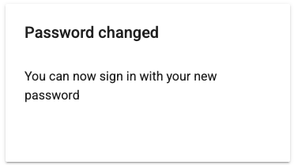
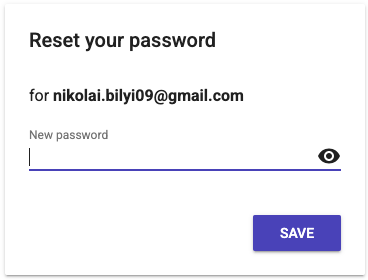

# Лабораторна робота №6
## Firebase Authentication та Firestore у React Native

**Студент:** Білий Микола Олексійович  
**Група:** ІПЗ 22-2

---

## Опис проєкту

Мобільний застосунок з реальною авторизацією через Firebase та збереженням персональних даних у Firestore.

Реалізовано:
- **Firebase Authentication** — реєстрація, вхід, вихід, відновлення паролю
- **Firestore** — збереження та редагування профілю користувача
- **Захищені маршрути** — редірект на login якщо не авторизований
- **Видалення акаунту** з повторною автентифікацією
- **Security Rules** — захист даних на рівні Firestore

---

## Інструкція із запуску

1. Клонувати репозиторій:
```bash
   git clone https://github.com/YOUR_USERNAME/MobileLabsRN2026.git
   cd MobileLabsRN2026/lab6
```

2. Встановити залежності:
```bash
   npm install
```

3. Запустити проєкт:
```bash
   npx expo start
```

4. Відсканувати QR-код додатком **Expo Go** на телефоні

---

## Скріншоти

| Вхід | Реєстрація | Профіль | Редагування | Процес відновлення паролю |
|------|------------|---------|-------------|-------------------|
|  |  |  |  |  |

---

## Висновки

### 1. Що таке Firebase Authentication?

Firebase Authentication — це сервіс від Google для авторизації користувачів. Підтримує вхід через email/пароль, Google, Facebook та інші провайдери. У цій роботі використано email/пароль авторизацію з функціями реєстрації, входу, виходу та відновлення паролю через email.

### 2. Що таке Firestore і як він працює?

Firestore — це хмарна NoSQL база даних від Firebase. Дані зберігаються у вигляді колекцій та документів. У цій роботі персональні дані користувача (ім'я, вік, місто) зберігаються у колекції `users` в документі з ID рівним `uid` користувача. Це гарантує що кожен користувач має свій унікальний документ.

### 3. Як реалізовано захист доступу до даних?

Захист реалізовано на двох рівнях. На рівні клієнта — перевірка `uid` при кожному запиті до Firestore, користувач може читати і писати лише у свій документ. На рівні сервера — Firestore Security Rules: